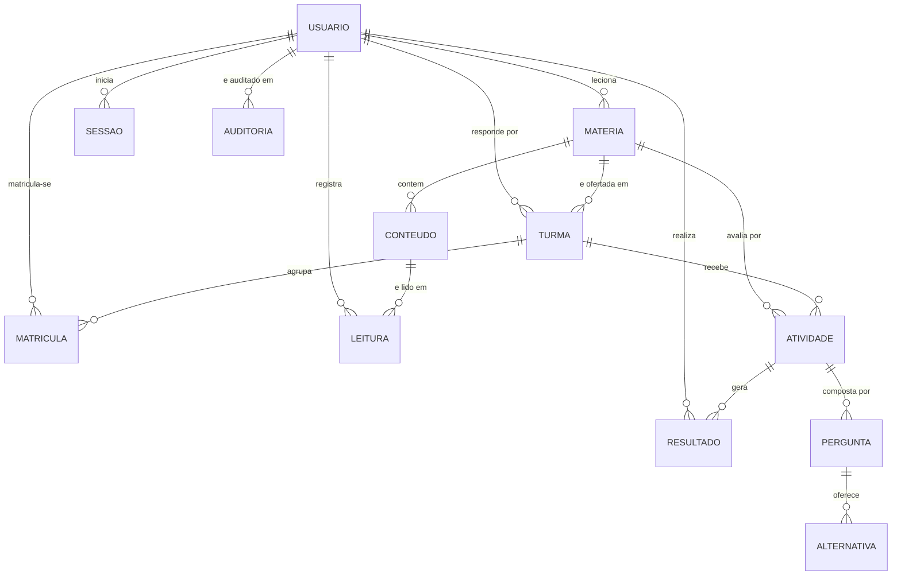
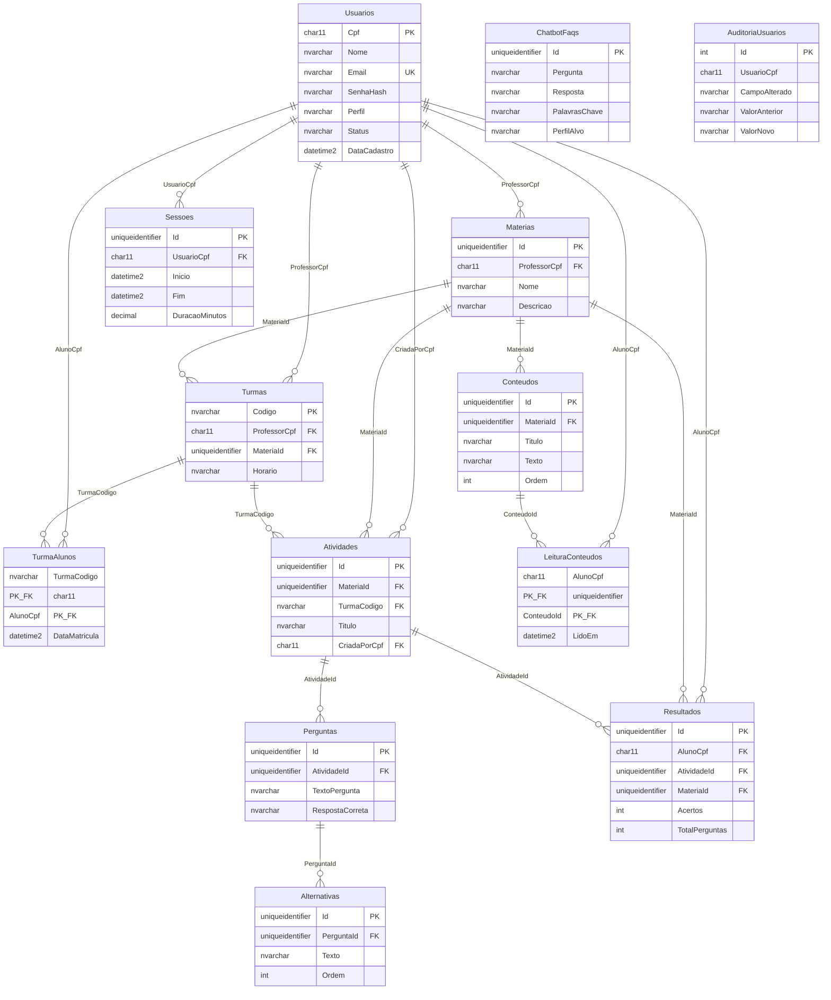

# Banco de Dados — Sistema Acadêmico Colaborativo Lumina

Projeto do banco de dados do PIM IV — Etapa 7.
SGBD: **Microsoft SQL Server 2019** ou superior.

---

## Ordem de execução

Os scripts são numerados e devem ser aplicados em sequência:

| Ordem | Arquivo | O que faz |
|-------|---------|-----------|
| 1 | `01_schema.sql` | Cria o banco, 13 tabelas e 15 índices. **Apaga tudo antes** — use apenas na carga inicial. |
| 2 | `02_procedures_triggers.sql` | Cria 4 procedures, 4 triggers, 1 view e a tabela de auditoria. Idempotente. |
| 3 | `03_carga_inicial.sql` | Insere dados de demonstração. Idempotente. Opcional em produção. |

```bash
sqlcmd -S localhost -E -i database/01_schema.sql              -f 65001
sqlcmd -S localhost -E -i database/02_procedures_triggers.sql -f 65001
sqlcmd -S localhost -E -i database/03_carga_inicial.sql       -f 65001
```

O parâmetro `-f 65001` define a página de código UTF-8, necessária para
que os acentos sejam gravados corretamente.

---

## Modelo Conceitual (MER)

Entidades e relacionamentos, sem detalhes de implementação:



### Cardinalidades principais

| Relacionamento | Cardinalidade | Leitura |
|---|---|---|
| Usuário → Sessão | 1:N (0,n) | Um usuário inicia nenhuma ou várias sessões; cada sessão pertence a um único usuário |
| Usuário ↔ Turma | N:N | Um aluno cursa várias turmas; uma turma reúne vários alunos — resolvido por `TurmaAlunos` |
| Matéria → Conteúdo | 1:N | Uma matéria reúne vários conteúdos; cada conteúdo pertence a uma matéria |
| Atividade → Pergunta | 1:N | Uma avaliação tem várias questões |
| Pergunta → Alternativa | 1:N | Cada questão oferece várias opções de resposta |
| Usuário ↔ Atividade | N:N | Resolvido por `Resultados`, que carrega os atributos da avaliação |
| Usuário ↔ Conteúdo | N:N | Resolvido por `LeituraConteudos` |

---

## Modelo Lógico

Tabelas com chaves primárias (PK) e estrangeiras (FK):



### Normalização

O modelo está na **Terceira Forma Normal (3FN)**:

- **1FN** — todos os atributos são atômicos; não há campos multivalorados.
  As alternativas de uma questão, por exemplo, ficam em tabela própria em
  vez de uma lista separada por vírgulas.
- **2FN** — nas tabelas de chave composta (`TurmaAlunos`, `LeituraConteudos`),
  os atributos dependem da chave inteira, não de parte dela.
- **3FN** — não há dependências transitivas. O nome do professor não se
  repete em `Materias`: guarda-se apenas o CPF, e o nome vem por junção.

**Exceção consciente:** `Resultados` armazena `MateriaId`, que poderia ser
obtido navegando por `Atividades`. A redundância foi mantida porque os
relatórios por matéria são as consultas mais frequentes do sistema, e evitar
uma junção extra em cada uma delas compensa o custo de guardar a coluna.

---

## Objetos programáveis

### Procedures

| Nome | Finalidade |
|---|---|
| `sp_RankingGeral` | Classifica alunos por média ponderada de acertos. Aceita filtro por matéria. |
| `sp_RelatorioAluno` | Retorna três conjuntos: resumo, histórico de atividades e conteúdos lidos. |
| `sp_MatricularAluno` | Efetiva matrícula validando perfil, status, existência da turma e vagas. |
| `sp_DesempenhoTurma` | Classifica a turma em Destaque (≥80%), Em Progresso (60–79%) e Em Risco (<60%). |

A média usada é **ponderada** — total de acertos sobre total de perguntas —
e não a média aritmética das notas. Isso evita que uma avaliação de 2 questões
pese tanto quanto uma de 20.

### Triggers

| Nome | Regra aplicada |
|---|---|
| `tr_TurmaAlunos_LimiteVagas` | Impede ultrapassar 40 alunos por turma (**RN01** do PIM III) |
| `tr_Resultados_Validar` | Rejeita acertos negativos ou maiores que o total de perguntas |
| `tr_Sessoes_CalcularDuracao` | Calcula a duração da sessão quando o logout é registrado |
| `tr_Usuarios_Auditoria` | Grava em `AuditoriaUsuarios` toda mudança de perfil ou status (**RN02**) |

As regras foram implementadas no banco, e não apenas na aplicação, para que
valham em qualquer caminho de escrita — API, acesso direto ao SGBD ou
importação em massa.

### View

`vw_IndicadoresMateria` — consolida, por matéria, total de conteúdos,
atividades, turmas e a média geral. Alimenta os painéis gerenciais.

---

## Decisões de projeto

**CPF como chave primária de `Usuarios`.**
É uma chave natural: já identifica a pessoa de forma única e é o dado que o
usuário digita no login, dispensando um identificador artificial.

**`UNIQUEIDENTIFIER` (GUID) nas demais tabelas.**
Permite que a aplicação gere o identificador antes de gravar, o que simplifica
operações em lote e evita conflito caso o sistema seja distribuído.

**Senhas com BCrypt.**
Algoritmo de hash lento e com *salt* embutido, projetado para resistir a
ataques de força bruta. A senha em texto claro nunca chega ao banco.

**`RespostaCorreta` isolada em `Perguntas`.**
A API monta o DTO enviado ao aluno sem esse campo. A correção acontece no
servidor, de modo que o gabarito não pode ser lido pelo navegador nem pelo
aplicativo.

**Estratégias distintas de exclusão.**
`CASCADE` onde o filho não faz sentido sozinho (conteúdos de uma matéria);
`NO ACTION` onde a exclusão apagaria histórico acadêmico (resultados de
alunos); `SET NULL` em `Atividades.TurmaCodigo`, para que remover uma turma
transforme a atividade em geral em vez de destruí-la.

---

## Validação executada

Os três scripts foram aplicados em um banco criado do zero e verificados:

| Verificação | Resultado |
|---|---|
| Criação do schema | 13 tabelas, 95 índices |
| Procedures, triggers e view | 4 + 4 + 1 criados |
| Carga inicial | 5 usuários, 1 matéria, 1 turma, 1 atividade |
| `sp_RankingGeral` | Lucas 100%, Beatriz 66,67% |
| `sp_DesempenhoTurma` | Faixas "Destaque" e "Em Progresso" corretas |
| `tr_TurmaAlunos_LimiteVagas` | Bloqueou o 41º aluno; turma parou em 40 |
| `tr_Resultados_Validar` | Rejeitou acertos = 999 e acertos = -5 |
| `tr_Usuarios_Auditoria` | Registrou as mudanças de status |
